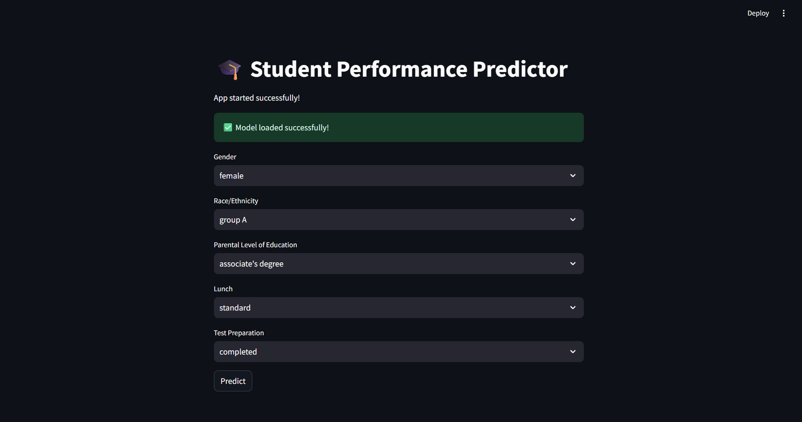
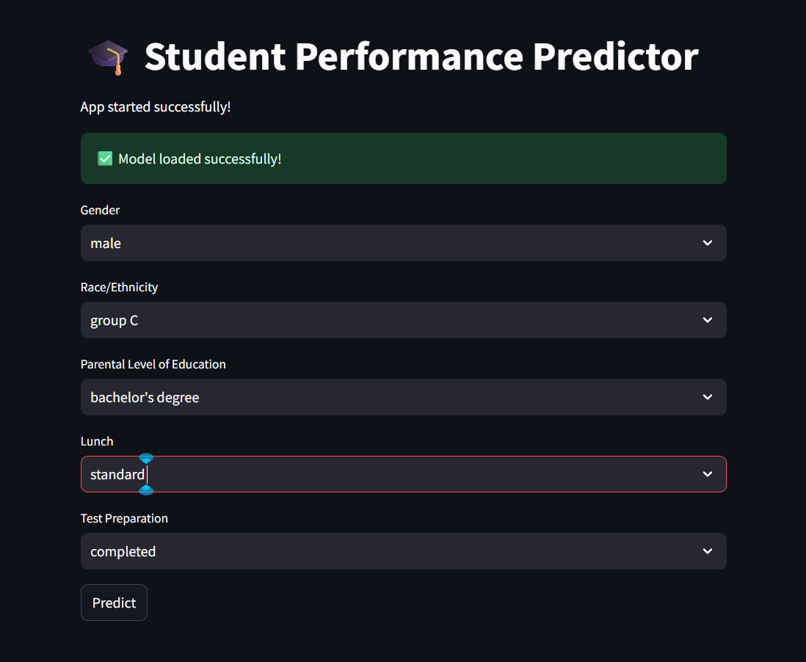
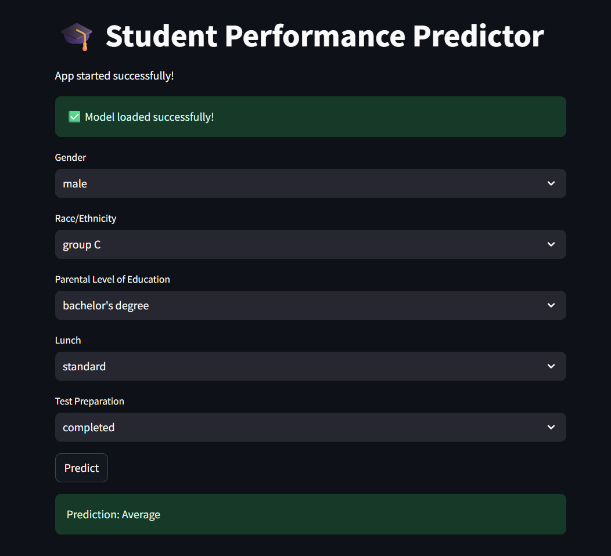

# 🎓 Student Performance Predictor

A Machine Learning web application that predicts a student's performance category based on demographic and educational factors.

Built using **Python**, **Scikit-learn**, and **Streamlit**, this project demonstrates a complete Machine Learning workflow from data preprocessing to deployment.

---

## 🚀 Live Demo

> Coming Soon

---

## 📌 Features

- Predicts student performance using Machine Learning
- Interactive web interface built with Streamlit
- Complete ML pipeline using Scikit-learn
- Automatic preprocessing using ColumnTransformer
- Model comparison between:
  - Logistic Regression
  - Decision Tree
  - Random Forest
- Saved trained model using Joblib
- Clean and modular project structure

---

## 🛠️ Technologies Used

- Python
- Pandas
- NumPy
- Scikit-learn
- Streamlit
- Joblib
- Git & GitHub

---

## 📂 Project Structure

```text
Student_Performance_Predictor
│
├── data/
│   └── StudentsPerformance.csv
│
├── models/
│   └── best_model.pkl
│
├── screenshots/
│   ├── home.png
│   ├── prediction.png
│   └── result.png
│
├── src/
│   ├── models/
│   │   ├── logistic_pipeline.py
│   │   ├── decision_tree_pipeline.py
│   │   └── random_forest_pipeline.py
│   │
│   ├── evaluate.py
│   ├── feature_engineering.py
│   ├── pipeline.py
│   ├── preprocessing.py
│   └── train.py
│
├── compare_models.py
├── save_model.py
├── streamlit_app.py
├── requirements.txt
└── README.md
```

---

# 📊 Dataset

The project uses the **Students Performance in Exams** dataset.

Features include:

- Gender
- Race/Ethnicity
- Parental Level of Education
- Lunch Type
- Test Preparation Course

The target variable is generated through feature engineering.

Performance Categories:

- 🟢 Excellent
- 🟡 Average
- 🔴 Needs Improvement

---

# 🤖 Machine Learning Models

Three different classification algorithms were trained and compared.

| Model | Accuracy |
|--------|---------:|
| Logistic Regression | **52.0%** |
| Decision Tree | 49.5% |
| Random Forest | 45.5% |

**Best Model:** Logistic Regression

---

# 📷 Screenshots

## Home Page



---

## Prediction



---

## Result



---

# ⚙️ Installation

Clone the repository

```bash
git clone https://github.com/Hashim-Pulparambil/student-performance-predictor.git
```

Move into the project

```bash
cd student-performance-predictor
```

Install dependencies

```bash
pip install -r requirements.txt
```

Run Streamlit

```bash
streamlit run streamlit_app.py
```

---

# 📈 Future Improvements

- Add XGBoost model
- Hyperparameter tuning
- Feature importance visualization
- Model explainability using SHAP
- Deploy on Streamlit Community Cloud
- Docker support

---

# 👨‍💻 Author

**Mohammed Hashim P**

B.Tech Computer Science & Engineering (AI & ML)

GitHub:
https://github.com/Hashim-Pulparambil

LinkedIn:
(www.linkedin.com/in/haashhiii)

---

## ⭐ If you like this project

Please consider giving it a ⭐ on GitHub!